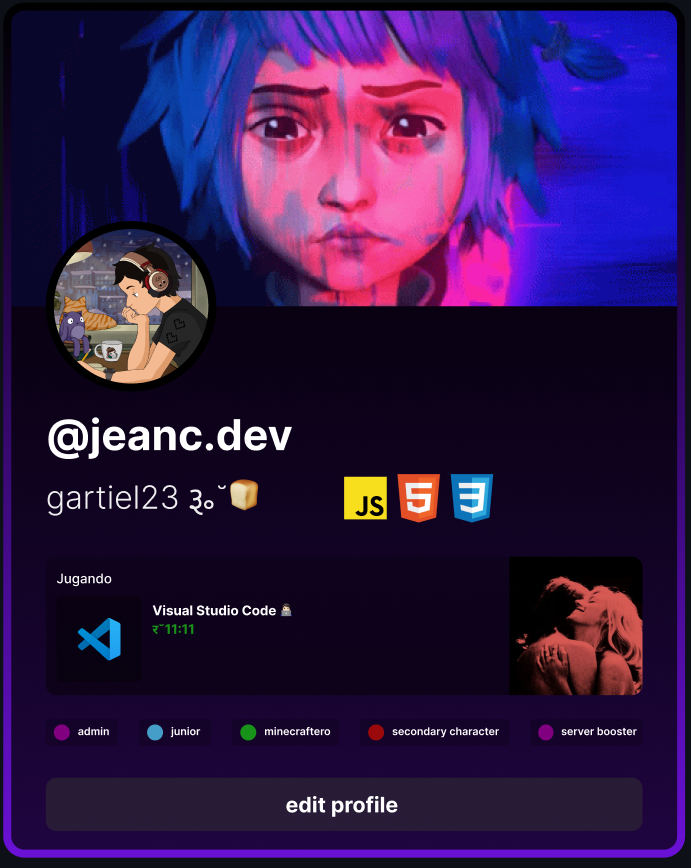

<h1 align="center">👋 Hi there</h1>

<hr/>

<!-- Link to the PDF file -->

<p align="center">
  <a href="./img/Profile.pdf">
    
  </a>
</p>

```javascript
- 👂 `My name is`: Jean
- 👦 `Pronouns`: He/Him
- ⚡ `I'm`: 18 years old
- 🌱 `I’m currently learning`: how to survive
- ❤️ `I love`: My puppy Amy
- 💻 `Favorite lang`: Javascript
```

<br/>

<h2 align="center">☕ Statistics</h2>

<p align="center">
  
  
  
</p>

<p align="center">
    
</p>

<h2 align="center">🚀 Projects</h2>
<p align="center">Take a look at my most outstanding projects.</p>
  
|  | Repository | Description | Technologies | Web |
| --- | --- | --- | --- | --- |
|  | [**Duolingo Clone Repo**](https://github.com/jeancdevx/duolingo-clone) | A clone of the Duolingo app | `NextJS` `Tailwind` `Typescript` `Neon Database` | [**Duolingo Clone**](https://duolingo-clone-dun.vercel.app/) |

<h2 align="center">🌱 My Skills</h2>

<h4 align="center">💻 Programming languages (and html)</h4>

<p align="center">
<a href="https://github.com/search?q=user%3ASammwyy1+language%3Acss"></a>
<a href="https://github.com/search?q=user%3ASammwyy1+language%3Ahtml"></a>
<a href="https://github.com/search?q=user%3ASammwyy1+language%3Ajavascript"></a>
<a href="https://github.com/search?q=user%3ASammwyy1+language%3Amarkdown"></a>
<a href="https://github.com/search?q=user%3ASammwyy1+language%3Ajavascript"></a>
<a href="https://github.com/search?q=user%3ASammwyy1+language%3AtypeScript"></a>
</p>

<h4 align="center">📚 Frameworks and Libraries</h4>

<p align="center">
<a href="#"></a>
<a href="#"></a>
<a href="#"></a>
<a href="#"></a>
</p>

<h4 align="center">⚙ Software</h4>

<p align="center">
<a href="#"></a>
<a href="#"></a>
<a href="#"></a>
</p>

<h4 align="center">☁ Cloud and Providers</h4>

<p align="center">
<a href="#"></a>
</p>


